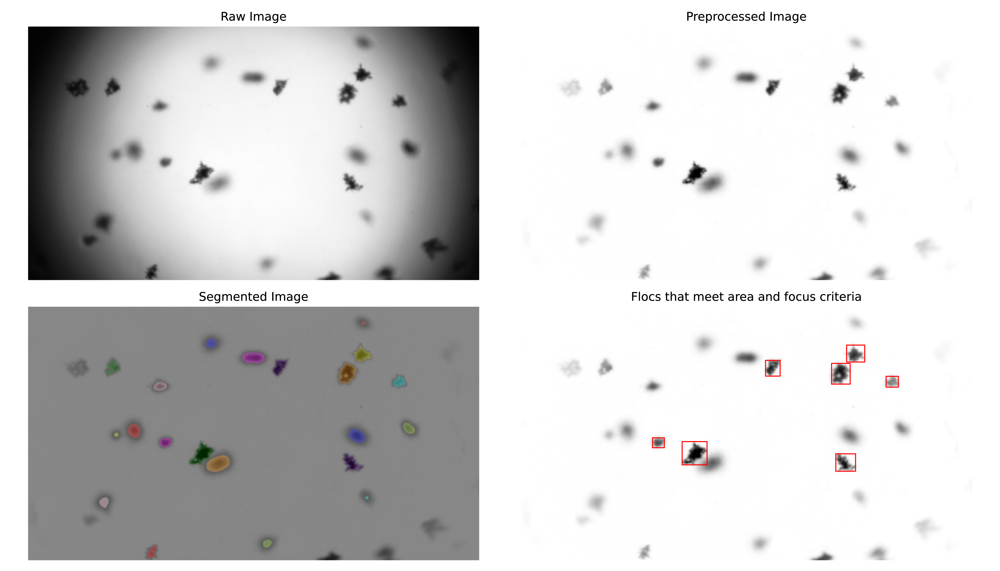

Mud floc image processing tools

Currently only tested on Windows machines

To install from the command prompt:

1. Download and install the latest version of [Anaconda](https://www.anaconda.com/products/individual)

2. Create a new python environment
```
conda create --name flocpyenv anaconda
```
3. install with pip
```
>>> pip install flocpy
```

