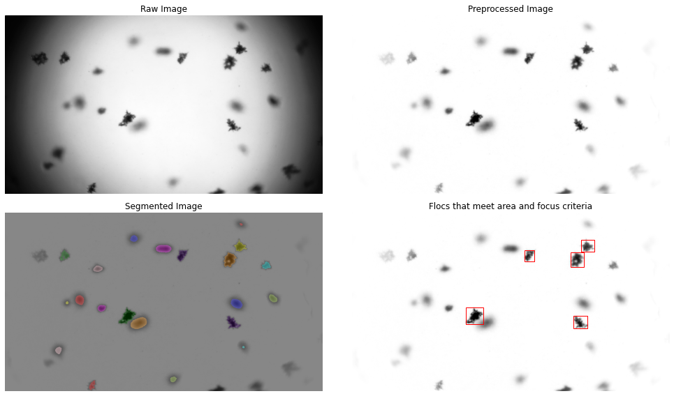
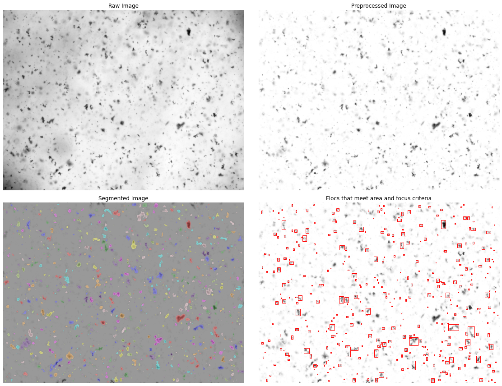

```python
import flocpy
import os
import glob
import datetime as dt
import numpy as np
import matplotlib.pyplot as plt
import pandas as pd
```

### Preparing the data

The floc identification software operates on a sorted list of images. Each element in the list should be a full path to an image file.


```python
paths = flocpy.testdata_paths()
imgset1_flist = glob.glob(os.path.join(paths[0], '*.bmp')) # image set 1
imgset2_flist = glob.glob(os.path.join(paths[1], '*.png')) # image set 2

print(imgset1_flist[0])
```

    c:\users\tashl\onedrive\documents\github\flocpy\flocpy\testdata\imgset1\023.bmp
    

If the files are conveniently named, you can use

    sorted_flist = sorted(flist)


```python
sorted_flist_1 = sorted(imgset1_flist)

for f in sorted_flist_1:
    print(os.path.basename(f))
```

    023.bmp
    024.bmp
    025.bmp
    026.bmp
    027.bmp
    028.bmp
    029.bmp
    030.bmp
    

Otherwise, it's best to define a custom function to facilitate sorting. In this case, we sort by a date and time encoded in the filename.


```python
def custom_datetime(fpath):
    dtprefix = 'img-'
    i0 = len(dtprefix)
    dtlen = 14
    fmt = '%m%d%Y%H%M%S'
    return dt.datetime.strptime(os.path.basename(fpath)[i0:i0+dtlen],fmt)

sorted_flist_2 = sorted(imgset2_flist, key=custom_datetime)

for f in sorted_flist_2:
    print(os.path.basename(f))
```

    img-01272022234452-11395.png
    img-01272022234544-11400.png
    img-01272022234646-11406.png
    

### Running the floc identification algorithm

To perform the analysis, use the identify_flocs function.

Required arguments:
* **flist**: A sorted list of flocs (created above)

Optional arguments:
* **resolution**: A scale factor for the pixels. In these examples, there are 0.95 microns per pixel.
* **min_area**: Ignores flocs that are smaller than a specified area (in specified units). The default value of zero will save all flocs regardless of size
* **max_edgewidth**: A threshold parameter for identifying out of focus flocs. Quantifies the distance over which the transition from bacgkround color to floc color is spread averaged over the perimeter of the floc. Shorter edgewidths are more focused. The default value of Inf will save all flocs regardless of focus
* **extra_params**: A list of parameters to save in addition to area and edgewidth. See the documentation for skimage.measure.regionprops for a list of options.
* **index**: Choose which images in the list to process. Default value is None, which will process all images. If index is an integer, only one image is processed and the function returns relevant outputs. If index is a list of integers or None, function returns None
* **save**: Boolean, if true, output is saved as .csv files that are named identically to images
* **return_data**: Boolean, if True, results are returned as a list of floc objects. Note that this will cause memory issues if analyzing more than a few images
* **njobs**: int, how many cores to use simultaneously. If njobs>1, parallel processing is performed using joblib
* **report_progress**: Boolean. True prints progress to console.


```python
# Run on image set 1:
out1 = flocpy.identify_flocs(sorted_flist_1,
                            resolution=0.95, 
                            min_diameter=0, 
                            max_edgewidth=np.inf,
                            extra_params=[], 
                            index=None,
                            save=False,            # output included with package
                            return_data=True,
                            n_jobs=2,
                            report_progress=True)
```

    [Parallel(n_jobs=2)]: Using backend LokyBackend with 2 concurrent workers.
    [Parallel(n_jobs=2)]: Done   1 tasks      | elapsed:   13.0s
    [Parallel(n_jobs=2)]: Done   4 tasks      | elapsed:   16.0s
    [Parallel(n_jobs=2)]: Done   6 out of   8 | elapsed:   18.4s remaining:    6.1s
    [Parallel(n_jobs=2)]: Done   8 out of   8 | elapsed:   21.1s remaining:    0.0s
    [Parallel(n_jobs=2)]: Done   8 out of   8 | elapsed:   21.1s finished
    


```python
# Visualize results

fig, ax = plt.subplots(figsize=(14, 8), nrows=2, ncols=2)
ax[0,0].axis('off')
ax[1,0].axis('off')
ax[0,1].axis('off')
ax[1,1].axis('off')

imgix = 4

ax[0,0].set_title('Raw Image')
out1[imgix].plot_segmentation(ax[0,0], use_raw_img=True, show_overlay=False, show_boxes=False, 
                         box_color='k', box_thickness=1)

ax[0,1].set_title('Preprocessed Image')
out1[imgix].plot_segmentation(ax[0,1], use_raw_img=False, show_overlay=False, show_boxes=False, 
                         box_color='k', box_thickness=1)

ax[1,0].set_title('Segmented Image')
out1[imgix].plot_segmentation(ax[1,0], use_raw_img=False, show_overlay=True, show_boxes=False, 
                         box_color='k', box_thickness=1)


ax[1,1].set_title('Flocs that meet area and focus criteria')
out1[imgix].plot_segmentation(ax[1,1], min_diameter=10, max_edgewidth=10, use_raw_img=False, show_overlay=False, show_boxes=True, 
                         box_color='r', box_thickness=1)

plt.tight_layout()
```


    

    


```python
# run on image set 2
out2 = flocpy.identify_flocs(sorted_flist_2,
                            resolution=0.95, 
                            min_diameter=0, 
                            max_edgewidth=np.inf,
                            extra_params=[], 
                            index=None,
                            save=False,                  # output included with package
                            return_data=True,
                            n_jobs=2,
                            report_progress=True)
```

    [Parallel(n_jobs=2)]: Using backend LokyBackend with 2 concurrent workers.
    [Parallel(n_jobs=2)]: Done   3 out of   3 | elapsed:   38.6s remaining:    0.0s
    [Parallel(n_jobs=2)]: Done   3 out of   3 | elapsed:   38.6s finished
    


```python
# visualize results
fig, ax = plt.subplots(figsize=(16, 12), nrows=2, ncols=2)

ax[0,0].axis('off')
ax[1,0].axis('off')
ax[0,1].axis('off')
ax[1,1].axis('off')

ax[0,0].set_title('Raw Image')
out2[2].plot_segmentation(ax[0,0], use_raw_img=True, show_overlay=False, show_boxes=False)

ax[0,1].set_title('Preprocessed Image')
out2[2].plot_segmentation(ax[0,1], use_raw_img=False, show_overlay=False, show_boxes=False)

ax[1,0].set_title('Segmented Image')
out2[2].plot_segmentation(ax[1,0], use_raw_img=False, show_overlay=True, show_boxes=False)


ax[1,1].set_title('Flocs that meet area and focus criteria')
out2[2].plot_segmentation(ax[1,1], min_diameter=10, max_edgewidth=4, use_raw_img=False, show_overlay=False, show_boxes=True, 
                         box_color='r', box_thickness=1)

plt.tight_layout()
```


    

    


```python
timeseries_flist = glob.glob(os.path.join(paths[1], '*.csv'))

sorted_flist_timeseries = sorted(timeseries_flist, key=custom_datetime)

for f in sorted_flist_timeseries[:3]:
    print(os.path.basename(f))
```

    img-01272022234442-11394.csv
    img-01272022234452-11395.csv
    img-01272022234503-11396.csv
    


```python
tlist = [custom_datetime(os.path.basename(f)) for f in sorted_flist_timeseries]
for t in tlist[:3]:
    print(t)
```

    2022-01-27 23:44:42
    2022-01-27 23:44:52
    2022-01-27 23:45:03
    


```python
focal_range = 2000 # microns
w_frame = 4000 * 0.95 # 4000 pixels * 0.95 microns per pixel
l_frame = 3000 * 0.95 # 3000 pixels * 0.95 microns per pixel
a_frame = w_frame * l_frame
    
rhos_mgl = 2650000 #sediment density in mg/l

flocstats_obj = flocpy.calculate_summarystats(sorted_flist_timeseries, frame_area=a_frame, focal_range=focal_range,
                                              min_floc_diameter=10, max_edgewidth=4)

percentiles = np.array([0.1, 1, 2.5, 10, 16, 25, 36, 50, 64, 75, 84, 90, 97.5, 99, 99.9])
table_dict = flocstats_obj.get_flocstats_table(method='all', percentile=percentiles)
floc_dataframe = pd.DataFrame(table_dict)
floc_dataframe.set_index('index', inplace=True)
```

    Loading data
    

    100%|██████████████████████████████████████████████████████████████████████████████████| 19/19 [00:00<00:00, 97.20it/s]
    


```python
floc_dataframe
```


<div>
<style scoped>
    .dataframe tbody tr th:only-of-type {
        vertical-align: middle;
    }

    .dataframe tbody tr th {
        vertical-align: top;
    }

    .dataframe thead th {
        text-align: right;
    }
</style>
<table border="1" class="dataframe">
  <thead>
    <tr style="text-align: right;">
      <th></th>
      <th>Cs</th>
      <th>Df_0.1</th>
      <th>Df_1.0</th>
      <th>Df_2.5</th>
      <th>Df_10.0</th>
      <th>Df_16.0</th>
      <th>Df_25.0</th>
      <th>Df_36.0</th>
      <th>Df_50.0</th>
      <th>Df_64.0</th>
      <th>Df_75.0</th>
      <th>Df_84.0</th>
      <th>Df_90.0</th>
      <th>Df_97.5</th>
      <th>Df_99.0</th>
      <th>Df_99.9</th>
    </tr>
    <tr>
      <th>index</th>
      <th></th>
      <th></th>
      <th></th>
      <th></th>
      <th></th>
      <th></th>
      <th></th>
      <th></th>
      <th></th>
      <th></th>
      <th></th>
      <th></th>
      <th></th>
      <th></th>
      <th></th>
      <th></th>
    </tr>
  </thead>
  <tbody>
    <tr>
      <th>0</th>
      <td>244.641986</td>
      <td>10.281881</td>
      <td>12.638224</td>
      <td>15.097269</td>
      <td>22.73971</td>
      <td>27.308699</td>
      <td>33.005235</td>
      <td>39.426682</td>
      <td>47.699218</td>
      <td>56.525374</td>
      <td>64.710353</td>
      <td>72.62339</td>
      <td>78.942068</td>
      <td>96.876102</td>
      <td>100.595838</td>
      <td>116.628579</td>
    </tr>
  </tbody>
</table>
</div>


```python
Dfloc = floc_dataframe.iloc[0,1:].to_numpy()

fig, ax = plt.subplots()
ax.plot(Dfloc, percentiles, marker='o')
ax.set_ylim(0, 100)
ax.set_xlim(1e1, 2e2)


ax.set_xscale('log')
ax.set_xticks([10, 20, 30, 40, 50, 60, 70, 80, 90, 100, 200])
ax.set_xticklabels([10, 20, 30, 40, 50, 60, '', 80, '', 100, 200])

ax.set_ylabel('% finer by mass')
ax.set_xlabel(r'Floc Diameter ($\mu$m)')
```


    Text(0.5, 0, 'Floc Diameter ($\\mu$m)')


    

    


```python
table_dict = flocstats_obj.get_flocstats_table(index=tlist, method='frame', percentile=[16,50,84])
floc_dataframe = pd.DataFrame(table_dict)
floc_dataframe.set_index('index', inplace=True)
```


```python
floc_dataframe
```


<div>
<style scoped>
    .dataframe tbody tr th:only-of-type {
        vertical-align: middle;
    }

    .dataframe tbody tr th {
        vertical-align: top;
    }

    .dataframe thead th {
        text-align: right;
    }
</style>
<table border="1" class="dataframe">
  <thead>
    <tr style="text-align: right;">
      <th></th>
      <th>Cs</th>
      <th>Df_16</th>
      <th>Df_50</th>
      <th>Df_84</th>
    </tr>
    <tr>
      <th>index</th>
      <th></th>
      <th></th>
      <th></th>
      <th></th>
    </tr>
  </thead>
  <tbody>
    <tr>
      <th>0</th>
      <td>217.569729</td>
      <td>25.793956</td>
      <td>44.578975</td>
      <td>64.273569</td>
    </tr>
    <tr>
      <th>1</th>
      <td>253.488955</td>
      <td>27.497399</td>
      <td>50.547275</td>
      <td>74.029477</td>
    </tr>
    <tr>
      <th>2</th>
      <td>270.600607</td>
      <td>27.733509</td>
      <td>47.647773</td>
      <td>66.883084</td>
    </tr>
    <tr>
      <th>3</th>
      <td>259.021484</td>
      <td>26.410717</td>
      <td>47.432775</td>
      <td>71.669437</td>
    </tr>
    <tr>
      <th>4</th>
      <td>240.219236</td>
      <td>26.762231</td>
      <td>53.082091</td>
      <td>82.394202</td>
    </tr>
    <tr>
      <th>5</th>
      <td>253.839165</td>
      <td>27.907406</td>
      <td>47.055850</td>
      <td>64.351515</td>
    </tr>
    <tr>
      <th>6</th>
      <td>243.551511</td>
      <td>27.681302</td>
      <td>46.573389</td>
      <td>72.909784</td>
    </tr>
    <tr>
      <th>7</th>
      <td>255.598728</td>
      <td>28.096811</td>
      <td>48.991445</td>
      <td>67.221932</td>
    </tr>
    <tr>
      <th>8</th>
      <td>224.657981</td>
      <td>26.444495</td>
      <td>44.244575</td>
      <td>67.828142</td>
    </tr>
    <tr>
      <th>9</th>
      <td>240.816866</td>
      <td>25.560399</td>
      <td>48.158206</td>
      <td>73.106468</td>
    </tr>
    <tr>
      <th>10</th>
      <td>258.467996</td>
      <td>26.796867</td>
      <td>47.755848</td>
      <td>81.379993</td>
    </tr>
    <tr>
      <th>11</th>
      <td>256.799830</td>
      <td>28.847548</td>
      <td>49.171886</td>
      <td>67.951771</td>
    </tr>
    <tr>
      <th>12</th>
      <td>274.492437</td>
      <td>27.664109</td>
      <td>47.503516</td>
      <td>72.072222</td>
    </tr>
    <tr>
      <th>13</th>
      <td>184.158931</td>
      <td>26.323117</td>
      <td>44.441520</td>
      <td>60.798018</td>
    </tr>
    <tr>
      <th>14</th>
      <td>226.819169</td>
      <td>26.541093</td>
      <td>45.137240</td>
      <td>79.294132</td>
    </tr>
    <tr>
      <th>15</th>
      <td>279.418582</td>
      <td>28.226286</td>
      <td>49.958806</td>
      <td>72.949866</td>
    </tr>
    <tr>
      <th>16</th>
      <td>238.396805</td>
      <td>28.302398</td>
      <td>45.984463</td>
      <td>78.343901</td>
    </tr>
    <tr>
      <th>17</th>
      <td>232.289381</td>
      <td>28.300562</td>
      <td>48.408588</td>
      <td>70.510703</td>
    </tr>
    <tr>
      <th>18</th>
      <td>237.990339</td>
      <td>26.009581</td>
      <td>51.142155</td>
      <td>71.572765</td>
    </tr>
  </tbody>
</table>
</div>


```python
fig, ax = plt.subplots()
ax.plot(floc_dataframe.Df_50, marker='o')
ax.set_xlabel('Frame number')
ax.set_xticks(np.arange(0, 19, 3))
ax.set_ylabel(r'Median Floc Diameter ($\mu$m)')
```


    Text(0, 0.5, 'Median Floc Diameter ($\\mu$m)')


    

    


```python

```
